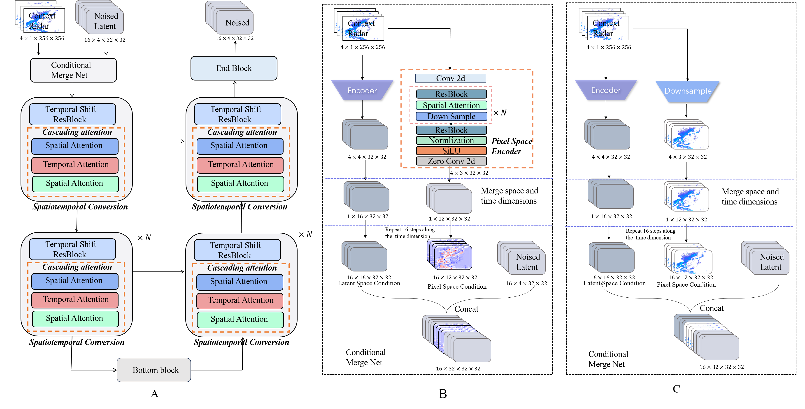
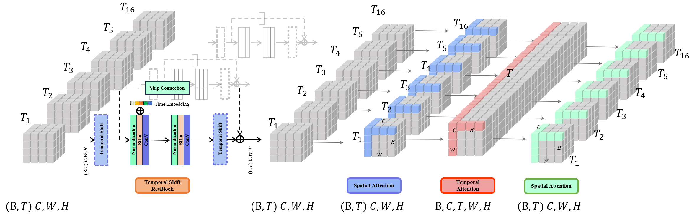

# Spacetime Separable Latent Diffusion Model with Intensity Structure Information for Precipitation Nowcasting

## Abstract
The growing volume of meteorological data and
advancements in computing performance have made the ap-
plication of deep learning technology in short-term rainfall
prediction crucial. However, existing learning approaches strug-
gle to accurately predict detailed spatial location information,
particularly obvious in predicting extreme rainfall events, leading
to inadequate prediction accuracy and subpar performance in
meteorological assessment indicators, limiting the effectiveness
and applicability of deep learning models in rainfall prediction.
To address these challenges, we propose a Spacetime Separable
Latent Diffusion Model with Intensity Structure Information
(SSLDM-ISI) to capture spatial and temporal information more
efficiently. SSLDM-ISI incorporates two key strategies to solve
the spatiotemporal information issue. First, a Spatiotemporal
Conversion Block within the backbone network effectively ex-
tracts and integrates spatiotemporal information. Second, our
proposed latent space coding technique based on rainfall intensity
structural information, enhances the information representation
ability of extreme rainfall. In addition, an examination of the
impact of various conditions is conducted on the prediction
results to enhance the model’s prediction accuracy and stabil-
ity. Through comparative analysis of meteorological evaluation
and image quality evaluation indicators on two datasets, our
proposed approach outperforms existing advanced technologies
in short-term rainfall prediction, achieving current state-of-the-
art results.

## 

## Spacetime Separable Latent Diffusion Model

## STC Block

# Pre-weight
pre-training you can find this address
https://drive.google.com/file/d/1IJPlnGeL_JZbALS6Iidr0sylnlFsIhdQ/view?usp=drive_link

## To Do

- [x] Provide clean training code
- [x] Provide clean sampling code

            
